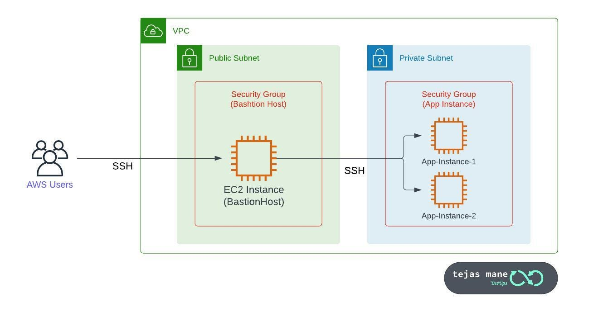

# Infrastructure Automation with Terraform and Ansible

## 1. Architecture Overview  
  

This project sets up a cloud infrastructure with a mix of **public** and **private** resources. The key components include:

- **Private Subnets**: Contain EC2 instances acting as private master/worker nodes, isolated for security.  
- **Public Bastion Host**: Acts as a gateway to securely access the private instances.  
- **Networking Components**: Includes essential networking setups such as NAT, Internet Gateway (IGW), Route Tables, and Security Groups.

## 2. Tools Used  

### **Terraform**  
Terraform is an Infrastructure as Code (IaC) tool used to provision and manage cloud resources. It ensures infrastructure consistency and enables easy deployment across environments.

### **Ansible**  
Ansible is an automation tool used for configuration management and application deployment. It helps in managing servers efficiently by automating tasks like package installations, configurations, and updates.

### **SSH Configuration**  
To access private servers, SSH configuration must be modified. This can be done by:
1. Running the Ansible playbook from the Bastion host.
2. Overriding the default SSH configuration locally to connect directly.

We will proceed with the second approach.

## 3. Running the Project  

### **Step 1: Override Default SSH Configuration**  
Before interacting with private servers, update your SSH configuration by running:

```bash

cd Terraform
terraform init
terraform apply -var-file="dev.tfvars"

cd AnsibleAutomation/
bash override_default_ssh_conf.sh
```
